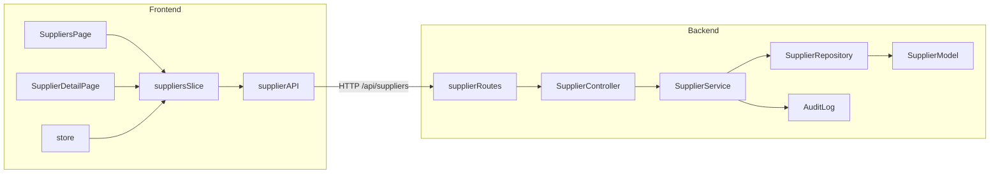

# Supplier Risk Module Plan

## Architecture




## Design System (match UsersPage exactly)

All new UI uses the same patterns from `UsersPage.jsx`:

- `page-header-premium anim-fade-in` header
- `stats-grid` + `dash-card anim-card` for stat cards
- `glass-panel` for forms
- `premium-table` inside `dash-card table-section`
- `search-box-premium`, `status-pill`, `role-chip` (adapted for risk tiers)
- `shimmer-container` for loading, `empty-canvas` for empty state
- Lucide React icons throughout
- CSS variables: `--brand-primary`, `--risk-low/medium/high/critical`

Risk tier colors map to existing tokens:

- Low (0–30) → `--risk-low` (#2DB87A)
- Medium (31–60) → `--risk-medium` (#D48A00)
- High (61–80) → `--risk-high` (#E8572F)
- Critical (81–100) → `--risk-critical` (#C7253E)

## Backend Files

### 1. `[backend/src/models/Supplier.js](backend/src/models/Supplier.js)` — NEW

Full Mongoose schema with all 12 ML-ready fields:

- Identity: `orgId`, `name`, `contactEmail`, `contactPhone`, `country`, `category` (enum: raw_materials/components/finished_goods/services)
- Risk inputs: `weatherLevel` (low/medium/high), `onTimeDeliveryRate`, `avgDelayDays`, `defectRate`, `financialScore`, `yearsInBusiness`, `contractValue`, `geopoliticalRisk`
- Computed: `riskScore`, `riskTier` (low/medium/high/critical), `lastScoredAt`
- Status: `status` enum (active/under_watch/high_risk/suspended)
- History: `riskHistory[]` (snapshots of score+tier+date), `overrideHistory[]` (who overrode, justification, old/new values)

### 2. `[backend/src/models/index.js](backend/src/models/index.js)` — MODIFY

Replace stub `supplierSchema` inline definition with `export { Supplier } from './Supplier.js'`.

### 3. `[backend/src/repositories/SupplierRepository.js](backend/src/repositories/SupplierRepository.js)` — NEW

Mongoose queries all scoped by `orgId`:

- `findAll(orgId, { search, status, tier, skip, limit })`
- `findById(orgId, supplierId)`
- `create(data)` / `update(orgId, supplierId, data)`
- `findManyByIds(orgId, ids)` (for comparison)
- `appendRiskSnapshot(supplierId, snapshot)`

### 4. `[backend/src/services/SupplierService.js](backend/src/services/SupplierService.js)` — NEW

Business logic:

- CRUD (create/update enforce org isolation)
- `computeRiskScore(supplier)` — rule-based score calculation from the 12 features (ML service call when available, rule-based fallback)
- `overrideScore(supplierId, analystId, newScore, justification)` — writes to `overrideHistory` and `AuditLog`
- `compareSuppliers(orgId, ids[])` — returns side-by-side metrics for up to 3 suppliers
- `updateStatus(supplierId, status)` — state management

### 5. `[backend/src/controllers/SupplierController.js](backend/src/controllers/SupplierController.js)` — NEW

Thin controller methods for all 7 routes.

### 6. `[backend/src/routes/supplierRoutes.js](backend/src/routes/supplierRoutes.js)` — MODIFY (replace stubs)

Wire controller methods with proper RBAC:


| Method | Path                  | Auth                    |
| ------ | --------------------- | ----------------------- |
| GET    | `/`                   | authenticate            |
| POST   | `/`                   | ORG_ADMIN               |
| POST   | `/compare`            | authenticate            |
| GET    | `/:id`                | authenticate            |
| PUT    | `/:id`                | ORG_ADMIN               |
| GET    | `/:id/history`        | authenticate            |
| POST   | `/:id/override-score` | RISK_ANALYST, ORG_ADMIN |
| PATCH  | `/:id/status`         | ORG_ADMIN               |


## Frontend Files

### 7. `[frontend/src/utils/api.js](frontend/src/utils/api.js)` — MODIFY

Expand `supplierAPI` with all endpoints:

```javascript
compareSuppliers: (ids) => apiClient.post('/suppliers/compare', { ids }),
getRiskHistory: (id) => apiClient.get(`/suppliers/${id}/history`),
overrideScore: (id, data) => apiClient.post(`/suppliers/${id}/override-score`, data),
updateStatus: (id, data) => apiClient.patch(`/suppliers/${id}/status`, data),
```

### 8. `[frontend/src/redux/suppliersSlice.js](frontend/src/redux/suppliersSlice.js)` — NEW

Redux slice following `usersSlice.js` pattern. Async thunks:

- `listSuppliers`, `getSupplier`, `createSupplier`, `updateSupplier`
- `compareSuppliers`, `getRiskHistory`, `overrideScore`, `updateSupplierStatus`

State shape: `{ suppliers, selectedSupplier, riskHistory, comparisonData, total, loading, error, message }`

### 9. `[frontend/src/redux/store.js](frontend/src/redux/store.js)` — MODIFY

Add `suppliers: suppliersReducer` to the store.

### 10. `[frontend/src/pages/SuppliersPage.jsx](frontend/src/pages/SuppliersPage.jsx)` — NEW

Main suppliers page with:

- **Header** — `page-header-premium` with "Add Supplier" button (ORG_ADMIN only)
- **Stats row** — Total Suppliers, Active, Under Watch/High Risk count, Average Risk Score
- **Add/Edit form** — `glass-panel` with all profile fields (same pattern as invite form in UsersPage)
- **Filter bar** — status filter tabs + search box
- **Table** — `premium-table` with: name+country identity cell, category chip, risk score bar + tier chip, status pill, actions (View Detail, Edit, Status change)
- Clicking a supplier name navigates to `/suppliers/:id`

### 11. `[frontend/src/pages/SupplierDetailPage.jsx](frontend/src/pages/SupplierDetailPage.jsx)` — NEW

Detail view with:

- **Back button** + breadcrumb
- **Risk score gauge** — large circular/arc display of 0–100 score with tier color
- **Performance metrics grid** — on-time rate, avg delay days, defect rate, financial score as stat cards
- **Risk history chart** — Line chart via Chart.js showing score over time
- **Geopolitical risk** — country flag indicator
- **Override form** — `glass-panel` visible to RISK_ANALYST/ORG_ADMIN (new score + justification textarea)
- **Override history table** — who overrode, when, old → new, justification

### 12. `[frontend/src/App.jsx](frontend/src/App.jsx)` — MODIFY

Replace `<div className="temp-page">` placeholder for `/suppliers` and add `/suppliers/:id` route:

```jsx
<Route path="/suppliers" element={<ProtectedRoute><SuppliersPage /></ProtectedRoute>} />
<Route path="/suppliers/:id" element={<ProtectedRoute><SupplierDetailPage /></ProtectedRoute>} />
```

### 13. `[frontend/src/styles/pages.css](frontend/src/styles/pages.css)` — MODIFY

Append supplier-specific styles:

- `.risk-tier-chip` variants (low/medium/high/critical) using existing `--risk-*` tokens
- `.supplier-status-pill` variants (active/under_watch/high_risk/suspended)
- `.risk-score-bar` — inline horizontal progress bar colored by tier
- `.risk-gauge` — the large circular score display on detail page
- `.score-override-log` — override history table styling
- `.filter-tabs` — horizontal tab-style status filter buttons

