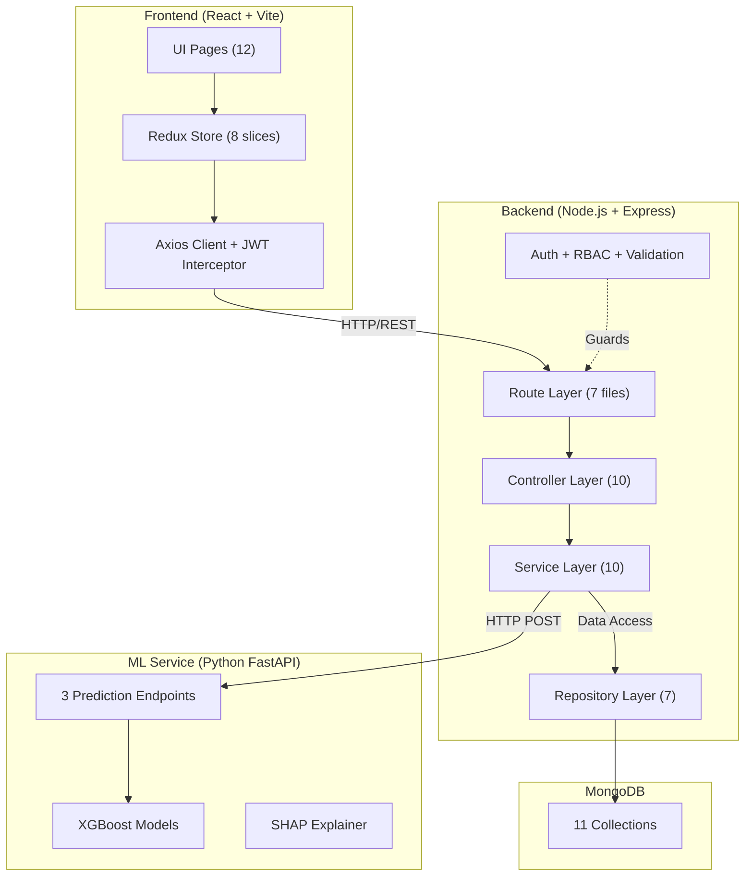
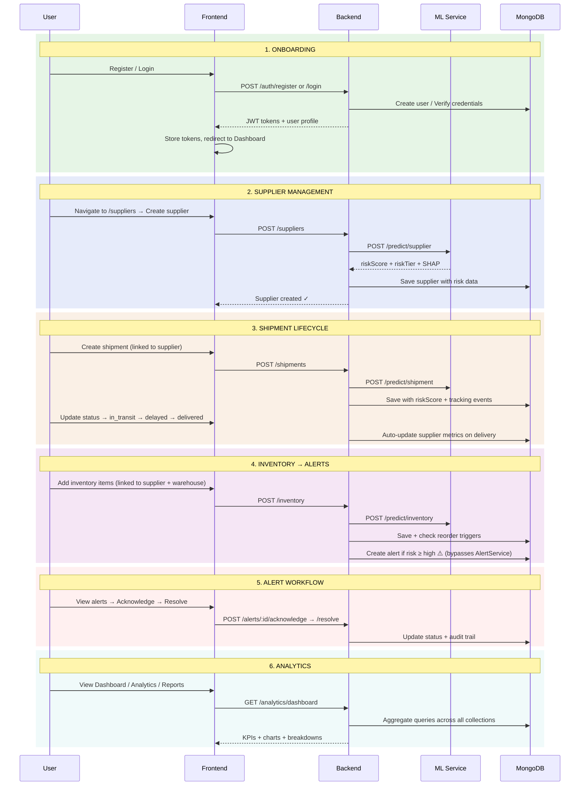

# Logistics18 — Comprehensive Architecture Audit Report

**Date:** April 5, 2026  
**Scope:** Full-stack codebase audit (Backend, Frontend, ML Service)  
**Stack:** Node.js/Express · React/Vite · Python FastAPI · MongoDB · XGBoost

---

## 1. Executive Summary

Logistics18 is a **well-structured** supply chain risk management platform with solid foundational patterns — layered backend architecture, centralized RBAC, JWT token rotation, and ML-powered risk scoring with graceful fallback. For an academic/team project, the maturity is notably above average.

However, the system has **critical gaps that would prevent reliable production deployment**:

| Verdict | Details |
|---|---|
| 🟢 **Strong** | Layered architecture, RBAC design, auth security, audit trail |
| 🟡 **Moderate** | ML integration pattern, frontend component structure, state management |
| 🔴 **Weak** | Data flow integrity, scalability, error resilience, test coverage |

> [!NOTE]
> **Single-org deployment** — Multi-tenant isolation was intentionally removed. The system operates for a single organization, so orgId-scoping inconsistencies are not a bug.

**Overall: The system is ~70% production-ready.** The architecture is logically sound but has several hardcoded business rules, no horizontal scaling strategy, and insufficient test coverage.

---

## 2. Key Issues (Prioritized)

### 🔴 Critical (Blocks Production)

1. **ML Service Returns Random Scores When Models Missing** — When `.joblib` model files don't exist, all three `/predict/*` endpoints return `np.random.uniform(0, 100)`, meaning **every API call produces different risk scores for the same data**. This is silently used by the backend.

2. **No API Rate Limiting** — No rate limiter middleware on any endpoint. A single client can overwhelm the server, and auth endpoints (`/login`, `/register`) are fully exposed to brute-force attacks.

3. **Hardcoded Supplier Delivery Count** — In [ShipmentService._updateSupplierOnDelivery()](file:///c:/Users/ASUS/Desktop/Logistics18/backend/src/services/ShipmentService.js#L610-L648), `totalDeliveries = 10` is hardcoded, making the running average calculation incorrect after the 10th delivery.

### 🟡 Major (Degraded Functionality)

4. **Residual `orgId` Code** — Auth middleware still injects `orgId` into JWT tokens, [validateOrgId](file:///c:/Users/ASUS/Desktop/Logistics18/backend/src/middleware/auth.js#202-226) middleware exists, and some repositories still accept `orgId` parameters even though filtering is no longer needed. This dead code adds confusion. *(Low priority cleanup)*

5. **Alert Escalation Has Redundant/Wasteful Queries** — [AlertService.escalateOverdueAlerts()](file:///c:/Users/ASUS/Desktop/Logistics18/backend/src/services/AlertService.js#L205-L245) calls `AlertRepository.findByOrgId(null, {}, {})` (fetching ALL alerts), then immediately queries `Alert.find()` with the actual filter. The first query result is never used.

6. **No Frontend Error Boundary** — No React ErrorBoundary component exists. Any uncaught rendering exception crashes the entire app with a white screen.

7. **`dotenv.config()` Called After Imports** — In [app.js](file:///c:/Users/ASUS/Desktop/Logistics18/backend/src/app.js#L23), `dotenv.config()` runs at line 23, but modules imported at lines 1–20 (including [database.js](file:///c:/Users/ASUS/Desktop/Logistics18/backend/src/config/database.js) which reads `MONGODB_URI`) may have already resolved `process.env` values. [database.js](file:///c:/Users/ASUS/Desktop/Logistics18/backend/src/config/database.js) calls its own `dotenv.config()` to work around this.

8. **VIEWER Role Excluded From Most Routes** — The `VIEWER` role is defined but excluded from supplier, shipment, and alert route guards both in [rbac.constants.js](file:///c:/Users/ASUS/Desktop/Logistics18/backend/src/config/rbac.constants.js) and in frontend [App.jsx](file:///c:/Users/ASUS/Desktop/Logistics18/frontend/src/App.jsx), defeating the purpose of a "read-only across all modules" role.

### 🟠 Moderate (Technical Debt)

10. **Duplicate RBAC Definitions** — Backend [rbac.constants.js](file:///c:/Users/ASUS/Desktop/Logistics18/backend/src/config/rbac.constants.js) and frontend [config/rbac.constants.js](file:///c:/Users/ASUS/Desktop/Logistics18/frontend/src/config/rbac.constants.js) must be manually kept in sync — there is no shared source of truth.

11. **Organisation vs Organization Spelling Inconsistency** — Models use 'Organisation' (UK spelling) but [InventoryItem](file:///c:/Users/ASUS/Desktop/Logistics18/frontend/src/utils/api.js#47-48) references 'Organization' (US spelling), as noted in the models/index.js comments.

12. **Missing Warehouse Routes in app.js** — `WarehouseController` and `WarehouseTransferController` exist but no dedicated route files for `/api/warehouses` — they're nested under `/api/inventory/warehouses` in [inventoryRoutes.js](file:///c:/Users/ASUS/Desktop/Logistics18/backend/src/routes/inventoryRoutes.js).

13. **No Connection Pooling Config** — Mongoose connects with default settings. No `maxPoolSize`, `minPoolSize`, or `socketTimeoutMS` configured for production workloads.

14. **Excessive Console Logging in Services** — `SupplierService.enrichSupplierData()` and `ShipmentService.enrichShipmentData()` contain 15+ `console.log()` calls each. No structured logger (Winston/Pino) is used.

---

## 3. Deep Analysis by Category

### 3.1 System Coherence & Real-World Viability



**Architecture Assessment:**
- ✅ Clean **Controller → Service → Repository** layering with clear separation of concerns
- ✅ Centralized RBAC with 5 roles and 50+ permission entries
- ✅ JWT access/refresh token rotation with reuse detection
- ✅ Immutable audit trail with TTL-based cleanup
- ⚠️ ML service is **fire-and-forget** — no circuit breaker, no retry logic, just a 5s timeout
- ⚠️ Cron-based shipment polling (every 15 min) won't scale beyond ~10K active shipments
- ❌ No health-check orchestration between services
- ❌ No API versioning (`/api/v1/...`)

### 3.2 Module Communication & Data Consistency

| Source Module | Target Module | Communication Pattern | Risk |
|---|---|---|---|
| Shipment → Supplier | On delivery, auto-updates supplier metrics | **Tight coupling via direct repository call** | If supplier update fails, delivery still completes but metrics are stale |
| Inventory → Alert | Creates alerts when stock falls below reorder point | **Direct model access** (bypasses AlertService) | Circumvents cooldown/deduplication logic in AlertService |
| All Services → AuditLog | Direct `AuditLog.create()` calls | **Fire-and-forget** with `.catch()` | Audit log failures are silently swallowed |
| Backend → ML Service | Synchronous HTTP POST per prediction | **No queuing, no batching** | Each CRUD operation blocks on ML response (up to 5s) |
| Frontend → Backend | Axios with auto-refresh interceptor | **Well-implemented** | Good — handles token expiry transparently |

> [!CAUTION]
> **Data Consistency Risk:** `InventoryService.createRiskAlert()` and [createReorderAlert()](file:///c:/Users/ASUS/Desktop/Logistics18/backend/src/services/InventoryService.js#519-547) call `Alert.create()` directly, **bypassing** `AlertService.createAlert()` which has cooldown/deduplication logic. This means duplicate inventory alerts can be created.

### 3.3 Model Coordination (ML Service)

The ML pipeline has three XGBoost models with a well-designed fallback pattern:

```
Request → Enrich Data → Validate Features → Sanitize → ML Predict
                                                          ↓ (fails)
                                                   Rule-Based Fallback
```

**Issues:**
1. **No model versioning sync** — `featureVersion` is tracked in the backend utils, but the ML service has no concept of versions. If a model is retrained with different features, the backend's enrichment pipeline could send incompatible data.
2. **Mock predictions are random** — When models aren't loaded, `np.random.uniform(0, 100)` returns a random score, which then gets stored in MongoDB and drives alerts. The backend logs a warning but **proceeds to save the random value**.
3. **SHAP computation on every request** — `TreeExplainer.shap_values()` is called per-request, which is computationally expensive for large models.
4. **No model reload capability** — Models are loaded at startup only. Deploying a new model requires a full service restart.

### 3.4 State Management & Update Flow

**Backend State:**
- MongoDB is the single source of truth
- Each entity (suppliers, shipments, inventory) stores its own `riskScore`, `riskTier`, `riskHistory[]`
- Risk scores are **not proactively recalculated** — they only update on CRUD operations or the 15-min shipment poll
- Supplier metrics are updated when a linked shipment is delivered (cross-module state update)

**Frontend State:**

| Slice | Entities | Polling | Cache Invalidation |
|---|---|---|---|
| [auth](file:///c:/Users/ASUS/Desktop/Logistics18/backend/src/middleware/auth.js#163-201) | Current user session | None — one-shot `getMe()` | Manual on login/logout |
| `suppliers` | List + detail + risk history | None | On CRUD operations |
| `shipments` | List + detail + tracking | None | On CRUD operations |
| [inventory](file:///c:/Users/ASUS/Desktop/Logistics18/ml-service/main.py#179-210) | List + dashboard stats | None | On CRUD operations |
| `alerts` | List + dashboard + my alerts | None | On acknowledge/resolve |
| `analytics` | Dashboard KPIs + charts | None | None |
| `warehouse` | List + stats + transfers | None | On CRUD operations |
| `users` | List + activity log | None | On admin actions |

> [!WARNING]
> **No real-time updates.** The README claims "30-second polling intervals" for dashboards, but **no polling is implemented** in any Redux slice. Data only refreshes on page navigation or explicit user action.

**Cross-Slice Dependencies:**
- [inventory](file:///c:/Users/ASUS/Desktop/Logistics18/ml-service/main.py#179-210) slice doesn't react to changes in `suppliers` (supplier risk changes don't propagate to inventory risk views)
- `alerts` slice doesn't react to changes from any domain slice
- `analytics` data is fetched independently and can be stale relative to the domain data shown on other pages

### 3.5 Scalability & Reliability

| Concern | Current State | Impact |
|---|---|---|
| **Database Indexing** | Only TTL indexes created. No compound indexes on `orgId` + frequently queried fields | Queries degrade with data volume |
| **Connection Pool** | Mongoose defaults (5 connections) | Will bottleneck under ~50 concurrent users |
| **ML Service** | Single-process Python, synchronous per-request | SHAP + predict takes ~100-500ms per call. Under load, creates backpressure on Express |
| **Cron Polling** | [pollAllActiveShipments()](file:///c:/Users/ASUS/Desktop/Logistics18/backend/src/services/ShipmentService.js#514-581) loads ALL active shipments into memory and processes sequentially | Memory/time issues at >5K shipments |
| **CORS** | Single origin allowed | Cannot deploy behind CDN or multiple frontends |
| **No Caching** | No Redis/memory cache for frequently accessed data (dashboard stats, user roles) | Every dashboard load runs 10+ aggregate queries |
| **Graceful Shutdown** | Handled for SIGTERM/SIGINT, but doesn't drain the cron job or pending ML requests | In-flight operations may be interrupted |
| **No Health Dependencies** | Backend health check doesn't verify MongoDB or ML service connectivity | Load balancer can route to unhealthy instances |

### 3.6 End-to-End Workflow Analysis

The ideal user journey through the platform should be a **seamless cycle** from onboarding through risk-driven decision-making. Here's the expected flow and where it breaks:



#### Workflow Gaps & Breaks

| # | Step | Expected Behavior | Actual Behavior | Severity |
|---|---|---|---|---|
| **W1** | Dashboard → Quick Actions | Clicking "Users", "Suppliers", etc. navigates to that page | **Only shows a checkmark animation** — [triggerAction()](file:///c:/Users/ASUS/Desktop/Logistics18/frontend/src/pages/DashboardPage.jsx#139-143) sets a feedback state but has no `navigate()` or `href` | 🔴 Broken |
| **W2** | Dashboard auto-refresh | Dashboard KPIs update every 30 seconds (per README) | **No polling implemented.** Data fetches once on mount via `fetchDashboard()` and never refreshes | 🟡 Missing |
| **W3** | Shipment delivery → Supplier update | On delivery, supplier on-time rate updates accurately | Uses `totalDeliveries = 10` constant — **running average diverges from reality** after 10 deliveries | 🔴 Bug |
| **W4** | Inventory low stock → Alert | When stock < reorder point, an alert is created respecting cooldown logic | [InventoryService](file:///c:/Users/ASUS/Desktop/Logistics18/backend/src/services/InventoryService.js#13-573) calls `Alert.create()` directly, **bypassing [AlertService](file:///c:/Users/ASUS/Desktop/Logistics18/backend/src/services/AlertService.js#23-291) cooldown/deduplication** — duplicates possible | 🟡 Bug |
| **W5** | Alert escalation | Unacknowledged alerts auto-escalate via SLA timers | [escalateOverdueAlerts()](file:///c:/Users/ASUS/Desktop/Logistics18/backend/src/services/AlertService.js#201-246) is defined but **never called** — no cron job or endpoint triggers it automatically | 🔴 Missing |
| **W6** | Sidebar → Settings | Sidebar (unused) links to `/settings` | **No `/settings` route or page exists.** [App.jsx](file:///c:/Users/ASUS/Desktop/Logistics18/frontend/src/App.jsx) has no route for it — navigates to `/` (dashboard) | 🟠 Missing |
| **W7** | Sidebar navigation | Sidebar uses `<a>` tags for navigation | Causes **full page reload** instead of SPA navigation (should use React Router `<Link>`) — but sidebar is currently unused, TopNav is primary | 🟠 Dead code |
| **W8** | Cross-module risk propagation | When a supplier's risk score changes, linked inventory items reflect the updated supplier risk | **No propagation.** Inventory items cache `supplierRiskScore` at creation time and don't update when the supplier's score changes | 🟡 Missing |
| **W9** | Alert → Entity navigation | Clicking an alert should navigate to the affected supplier/shipment/inventory item | Alert detail page likely shows entity info but **no deep-link to the source entity** is implemented | 🟡 Missing |
| **W10** | Report download | User generates and downloads PDF/CSV reports | `analyticsService.generatePDF()` and [generateCSV()](file:///c:/Users/ASUS/Desktop/Logistics18/backend/src/services/analyticsService.js#513-541) exist but the **frontend `ReportsPage` flow needs to handle file download responses** | 🟡 Untested |

#### Recommended Workflow Fixes (Priority Order)

| # | Fix | Impact | Effort |
|---|---|---|---|
| 1 | **Wire Dashboard Quick Actions to `navigate()`** — Replace [triggerAction()](file:///c:/Users/ASUS/Desktop/Logistics18/frontend/src/pages/DashboardPage.jsx#139-143) with React Router `useNavigate()` calls to `/users`, `/suppliers`, `/alerts`, `/reports` | Fixes W1 | 30min |
| 2 | **Register alert escalation cron** — Add `cron.schedule('*/5 * * * *', AlertService.escalateOverdueAlerts)` in `app.js` alongside the shipment poller | Fixes W5 | 1h |
| 3 | **Implement dashboard polling** — Add `setInterval(() => dispatch(fetchDashboard()), 30000)` in `DashboardPage.jsx` with cleanup | Fixes W2 | 1h |
| 4 | **Route inventory alerts through AlertService** — Replace direct `Alert.create()` with `AlertService.createAlert()` in `InventoryService` | Fixes W4 | 2h |
| 5 | **Add supplier risk propagation** — When supplier risk is recalculated, update `supplierRiskScore` on all linked `InventoryItem` documents | Fixes W8 | 4h |
| 6 | **Add entity deep-links to alerts** — Include `entityUrl` field (e.g., `/suppliers/:id`) in alert responses and make the alert detail page link to it | Fixes W9 | 2h |
| 7 | **Fix the `totalDeliveries` bug** — Query the actual count from the database instead of using a hardcoded `10` | Fixes W3 | 1h |

---

## 4. Actionable Improvement Roadmap

### Phase 1: Critical Fixes (Week 1-2)

| # | Task | Priority | Effort |
|---|---|---|---|
| 1 | **Add rate limiting** — Install `express-rate-limit` on auth endpoints (5 req/min for login, 3/min for register) and a global limit (100 req/min per IP) | 🔴 Critical | 2h |
| 2 | **Fix ML mock scores** — Replace `np.random.uniform()` with deterministic rule-based fallback (same logic as backend) or return an error that forces the backend to use its own fallback | 🔴 Critical | 4h |
| 3 | **Fix hardcoded `totalDeliveries = 10`** — Query actual delivery count from `ShipmentRepository.countBySupplierAndStatus(supplierId, 'delivered')` | 🔴 Critical | 1h |
| 4 | **Add React ErrorBoundary** — Wrap `<App>` in an error boundary that shows a recovery UI instead of white screen | 🟡 Major | 2h |
| 5 | **Clean up residual orgId code** — Remove `validateOrgId` middleware, strip `orgId` from JWT payload if unused, clean up repository method signatures | 🟠 Moderate | 4h |

### Phase 2: Data Integrity & Module Coordination (Week 3-4)

| # | Task | Priority | Effort |
|---|---|---|---|
| 6 | **Route inventory alerts through AlertService** — Replace direct `Alert.create()` calls in `InventoryService` with `AlertService.createAlert()` to leverage cooldown/deduplication | 🟡 Major | 4h |
| 7 | **Fix alert escalation query** — Remove redundant `AlertRepository.findByOrgId(null, {}, {})` call in `escalateOverdueAlerts()` | 🟡 Major | 30m |
| 8 | **Add VIEWER role to read-only routes** — Update both backend route guards and frontend `App.jsx` ProtectedRoute for suppliers, shipments, and alerts (read endpoints only) | 🟡 Major | 3h |
| 9 | **Move `dotenv.config()` before all imports** — Use `--require dotenv/config` in the start script or move to top of `app.js` | 🟠 Moderate | 30m |
| 10 | **Add structured logging** — Replace `console.log/warn/error` with Winston or Pino with JSON output and log levels | 🟠 Moderate | 6h |

### Phase 3: Scalability & Resilience (Week 5-8)

| # | Task | Priority | Effort |
|---|---|---|---|
| 11 | **Add MongoDB compound indexes** — Create indexes for `{ orgId: 1, status: 1 }`, `{ orgId: 1, riskTier: 1 }`, `{ supplierId: 1, status: 1 }` on all domain collections | 🟡 Major | 4h |
| 12 | **Add Redis caching layer** — Cache dashboard aggregate results (60s TTL), user roles (5min TTL), and ML predictions for unchanged data | 🟡 Major | 16h |
| 13 | **Implement circuit breaker for ML service** — Use `opossum` library to prevent cascading failures when ML service is down | 🟡 Major | 4h |
| 14 | **Add API versioning** — Prefix all routes with `/api/v1/` to allow future breaking changes | 🟠 Moderate | 4h |
| 15 | **Implement dashboard polling** — Add configurable polling (or WebSocket) in Redux slices with `setInterval` for dashboard and alerts pages | 🟠 Moderate | 8h |
| 16 | **Paginate shipment polling cron** — Process active shipments in batches of 100 using cursor-based pagination | 🟠 Moderate | 4h |
| 17 | **Configure Mongoose pool** — Set `maxPoolSize: 20, minPoolSize: 5, socketTimeoutMS: 45000` | 🟠 Moderate | 1h |

### Phase 4: Architecture Improvements (Month 2+)

| # | Task | Priority | Effort |
|---|---|---|---|
| 18 | **Shared RBAC package** — Extract `rbac.constants.js` into a shared npm package consumed by both frontend and backend | 🟠 Moderate | 8h |
| 19 | **Event-driven inter-module communication** — Replace direct cross-service calls with an event bus (EventEmitter or Redis Pub/Sub) for shipment→supplier, inventory→alert flows | 🟠 Moderate | 24h |
| 20 | **Add comprehensive test suite** — Backend unit tests for all services (target 80% coverage), frontend component tests with Vitest + Testing Library | 🟡 Major | 40h |
| 21 | **Add OpenAPI/Swagger docs** — Auto-generate from route definitions using `swagger-jsdoc` | 🟠 Moderate | 8h |
| 22 | **ML model hot-reload** — Add an admin endpoint to reload models without service restart | 🟠 Moderate | 4h |
| 23 | **Implement health check dependencies** — Backend `/health` should verify MongoDB ping and ML service `/health` response | 🟠 Moderate | 2h |

---

## 5. Architecture Recommendations Summary

| Area | Current | Recommended |
|---|---|---|
| **Inter-Service Comm** | Direct HTTP calls | Add circuit breaker (opossum) + event bus for async operations |
| **Caching** | None | Redis for dashboard aggregates + ML predictions |
| **Logging** | `console.log()` | Winston/Pino with structured JSON, correlation IDs |
| **Monitoring** | None | Prometheus metrics + Grafana dashboards |
| **State Sync** | Frontend fetches on-demand | WebSocket/SSE for real-time alerts + dashboard updates |
| **Testing** | Minimal test structure exists | Jest (backend) + Vitest (frontend) with 80% coverage target |
| **Deployment** | Docker Compose (partial) | Complete Docker Compose + health checks + restart policies |
| **API Design** | REST, no versioning | Version prefix `/api/v1/` + OpenAPI documentation |

---

> [!NOTE]
> This audit is based on static code analysis. A runtime audit (load testing, penetration testing, dependency vulnerability scanning) should be performed separately before any production deployment.
