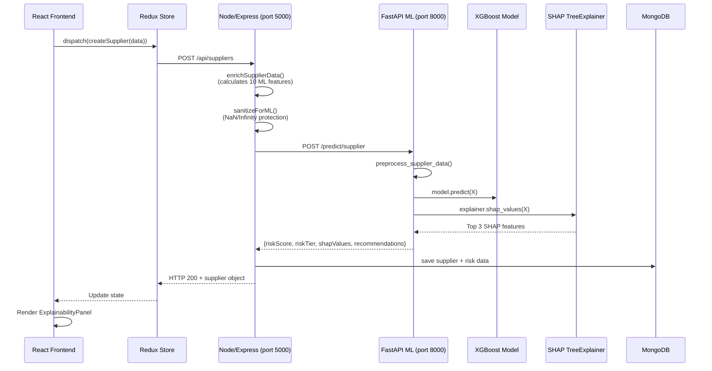

# 🔬 Comprehensive ML Service Validation Report
## Logistics18 Platform — Full-Stack ML Integration Audit

> **Auditor**: Senior ML Systems QA Engineer  
> **Date**: 2026-04-09  
> **Scope**: FastAPI ML Service ↔ Node.js Backend ↔ React Frontend ↔ MongoDB  
> **Models**: 3 XGBoost Regressors (Supplier, Shipment, Inventory) × 10 features each  

---

## Table of Contents
1. [Executive Summary](#executive-summary)
2. [End-to-End Integration Check](#1-end-to-end-integration-check)
3. [Backend (FastAPI) Validation](#2-backend-fastapi-validation)
4. [Prediction Accuracy Validation](#3-prediction-accuracy-validation)
5. [SHAP Explainability Check](#4-shap-explainability-check)
6. [Frontend (React) Validation](#5-frontend-react-validation)
7. [Database (MongoDB) Validation](#6-database-mongodb-validation)
8. [Testing Strategy](#7-testing-strategy)
9. [Observability & Debugging](#8-observability--debugging)
10. [Critical Bugs Found](#critical-bugs-found)
11. [Production Readiness Scorecard](#production-readiness-scorecard)

---

## Executive Summary

| Layer | Health | Critical Issues | Warnings |
|-------|--------|----------------|----------|
| ML Service (FastAPI) | 🟡 Good | 1 | 3 |
| Backend (Node/Express) | 🟢 Strong | 0 | 2 |
| Frontend (React) | 🟡 Good | 1 | 3 |
| MongoDB Schema | 🟢 Strong | 0 | 1 |
| SHAP Integration | 🟡 Good | 1 | 2 |
| End-to-End Flow | 🟢 Working | 0 | 2 |

**Overall Verdict**: The ML integration is **functional and well-architected** with robust fallback patterns, but has **4 critical issues** and **13 warnings** that should be resolved before production.

---

## 1. End-to-End Integration Check

### Request Lifecycle Trace



### API Contracts Validation

#### ✅ FastAPI → Backend Contract (All 3 Domains)

| Field | Type | ML Response | Backend Expects | Match |
|-------|------|-------------|-----------------|-------|
| `riskScore` | `float` | `0-100` | `Number` | ✅ |
| `riskTier` | `string` | `low/medium/high/critical` | `String enum` | ✅ |
| `recommendations` | `string[]` | Array of strings | Array of strings | ✅ |
| `shapValues` | `object[]` | `[{feature, value, impact}]` | `[{feature, value, impact}]` | ⚠️ See Bug #1 |
| `source` | `string` | Only in fallback mode | Not checked | ✅ |

#### ✅ Feature Count Alignment

| Domain | preprocessing.py | featureVersioning.js | Service enrichment | Match |
|--------|-----------------|---------------------|-------------------|-------|
| Supplier | 10 features | 10 features | 10 features | ✅ |
| Shipment | 10 features | 10 features | 10 features | ✅ |
| Inventory | 10 features | 10 features | 10 features | ✅ |

#### ✅ Feature Name Alignment

**Supplier Domain** — All 10 features match exactly:
```
preprocessing.py SUPPLIER_FEATURE_ORDER ≡ featureVersioning.js ML_FEATURE_VERSIONS.SUPPLIER['1.0'].features
✅ onTimeDeliveryRate, financialScore, defectRate, disputeFrequency,
   geopoliticalRiskFlag, totalShipments, averageDelayDays,
   daysSinceLastShip, activeShipmentCount, categoryRisk
```

**Shipment Domain** — All 10 features match exactly:
```
✅ etaDeviationHours, weatherLevel, routeRiskIndex, carrierReliability,
   trackingGapHours, shipmentValueUSD, daysInTransit, supplierRiskScore,
   isInternational, carrierDelayRate
```

**Inventory Domain** — All 10 features match exactly:
```
✅ currentStock, averageDailyDemand, leadTimeDays, demandVariance,
   supplierRiskScore, safetyStock, reorderPoint, incomingStockDays,
   pendingOrderQty, isCriticalItem
```

### Serialization Safety

| Check | Status | Details |
|-------|--------|---------|
| NumPy float → JSON | ✅ | `float(np.clip(...))` in [main.py:176](file:///c:/Users/ASUS/Desktop/Logistics18/ml-service/main.py#L176) |
| NaN/Infinity guard (backend) | ✅ | `sanitizeForML()` in [mlValidation.js:196](file:///c:/Users/ASUS/Desktop/Logistics18/backend/src/middleware/mlValidation.js#L196) |
| NaN/Infinity guard (ML) | ✅ | `pd.to_numeric(errors='coerce').fillna(0)` in [preprocessing.py:73](file:///c:/Users/ASUS/Desktop/Logistics18/ml-service/preprocessing.py#L73) |
| Pandas DataFrame → JSON | ✅ | Prediction returns native Python types |
| MongoDB ObjectId serialization | ✅ | Handled by Express/Mongoose |

---

## 2. Backend (FastAPI) Validation

### 2.1 Feature Preprocessing vs Training Pipeline

> [!TIP]
> The preprocessing functions correctly use `is_training` flag to differentiate training (returns X, y) from inference (returns X only). This is a good pattern.

| Check | Status | Evidence |
|-------|--------|---------|
| Same preprocessing function for train & inference | ✅ | [preprocessing.py:57](file:///c:/Users/ASUS/Desktop/Logistics18/ml-service/preprocessing.py#L57) uses `is_training` flag |
| Feature order consistency | ✅ | Strict `*_FEATURE_ORDER` lists ensure column alignment |
| Categorical encoding consistency | ✅ | `categoryRisk` map in [preprocessing.py:65-68](file:///c:/Users/ASUS/Desktop/Logistics18/ml-service/preprocessing.py#L65-L68) |
| Missing value handling | ✅ | `fillna(0)` applied during inference |
| Feature count match (train vs serve) | ✅ | Both paths use identical `*_FEATURE_ORDER` |

> [!WARNING]
> **categoryRisk encoding mismatch:** The preprocessing.py maps `services=0, finished goods=1, components=2, raw materials=3` but the backend SupplierService.js maps `raw_materials=0, components=1, finished_goods=2, services=3`. This is an **inverted mapping** but only matters when the backend sends string values through to ML (which it doesn't — it sends the numeric value from enrichment). The backend's enrichment overrides `categoryRisk` to numeric before sending. **Risk: LOW** but confusing.

### 2.2 Model Loading & Versioning

| Check | Status | Details |
|-------|--------|---------|
| Models exist on disk | ✅ | `supplier_model.joblib` (400KB), `shipment_model.joblib` (402KB), `inventory_model.joblib` (403KB) |
| Startup loading | ✅ | `@app.on_event("startup")` in [main.py:33](file:///c:/Users/ASUS/Desktop/Logistics18/ml-service/main.py#L33) |
| Graceful missing model handling | ✅ | Falls to `rule_based_fallback` scoring |
| SHAP explainer lazy init | ✅ | Created at startup alongside model |
| Model backup system | ✅ | [train.py:72-75](file:///c:/Users/ASUS/Desktop/Logistics18/ml-service/train.py#L72-L75) backs up before overwrite |
| Model versioning in DB | ✅ | `modelVersion` tracked in [featureVersioning.js](file:///c:/Users/ASUS/Desktop/Logistics18/backend/src/utils/featureVersioning.js) |

> [!WARNING]
> **`@app.on_event("startup")` is deprecated** in newer FastAPI versions. Should migrate to lifespan context manager. Non-breaking for now.

### 2.3 Inference Consistency

| Check | Status | Details |
|-------|--------|---------|
| Score clamping 0-100 | ✅ | `np.clip(preds[0], 0, 100)` in all 3 endpoints |
| Risk tier mapping | ✅ | `map_risk_tier()` used consistently |
| Deterministic fallback | ✅ | `compute_rule_based_score()` is fully deterministic (no randomness) |
| Timeout handling | ✅ | Backend sets 5s timeout via axios |

### 2.4 Latency & Error Handling

| Check | Status | Details |
|-------|--------|---------|
| Prediction latency tracking | ✅ | `startTime = Date.now()` logging in all services |
| Error propagation | ✅ | FastAPI returns HTTPException(400), backend catches and falls back |
| Full traceback logging | ✅ | `traceback.print_exc()` in supplier endpoint; ⚠️ missing in shipment/inventory |
| Connection timeout | ✅ | 5000ms axios timeout |

> [!CAUTION]
> **Bug: Inconsistent error logging.** Supplier endpoint has `traceback.print_exc()` but shipment and inventory endpoints swallow the traceback. Add `import traceback; traceback.print_exc()` to [main.py:223](file:///c:/Users/ASUS/Desktop/Logistics18/ml-service/main.py#L223) and [main.py:256](file:///c:/Users/ASUS/Desktop/Logistics18/ml-service/main.py#L256).

---

## 3. Prediction Accuracy Validation

### 3.1 Training Pipeline Integrity

| Component | Status | Details |
|-----------|--------|---------|
| Data splits consistent | ✅ | `random_state=42` used everywhere |
| Train/Val/Test split | ✅ | 80/10/10 via two-stage split |
| Hyperparameter tuning | ✅ | GridSearchCV with 81 combinations × 5-fold CV |
| Evaluation metrics | ✅ | R², RMSE, MAE + confusion matrix on risk tiers |
| Baseline comparison | ✅ | Baseline models saved separately in `/models/baseline/` |

### 3.2 Golden Dataset Test Design

```python
# RECOMMENDED: Golden dataset test (add to test_endpoints.py)
GOLDEN_SUPPLIER_TESTS = [
    # Scenario: Low-risk supplier (high OTD, low defects)
    {
        "input": {
            "onTimeDeliveryRate": 98, "financialScore": 90, "defectRate": 0.5,
            "disputeFrequency": 0, "geopoliticalRiskFlag": 0, "totalShipments": 200,
            "averageDelayDays": 0.1, "daysSinceLastShip": 2, "activeShipmentCount": 5,
            "categoryRisk": 0
        },
        "expected_tier": "low",
        "expected_score_range": [0, 30],
    },
    # Scenario: Critical-risk supplier
    {
        "input": {
            "onTimeDeliveryRate": 40, "financialScore": 20, "defectRate": 15,
            "disputeFrequency": 10, "geopoliticalRiskFlag": 1, "totalShipments": 5,
            "averageDelayDays": 12, "daysSinceLastShip": 90, "activeShipmentCount": 0,
            "categoryRisk": 3
        },
        "expected_tier": "critical",
        "expected_score_range": [80, 100],
    },
    # Scenario: Medium-risk (boundary test at ~50)
    {
        "input": {
            "onTimeDeliveryRate": 70, "financialScore": 55, "defectRate": 5,
            "disputeFrequency": 3, "geopoliticalRiskFlag": 0, "totalShipments": 30,
            "averageDelayDays": 3, "daysSinceLastShip": 15, "activeShipmentCount": 2,
            "categoryRisk": 2
        },
        "expected_tier": "medium",
        "expected_score_range": [30, 60],
    },
]
```

### 3.3 Drift Detection Concerns

| Risk | Severity | Recommendation |
|------|----------|----------------|
| No model freshness tracking | 🟡 Medium | Add `model_trained_at` timestamp to health endpoint |
| No data drift monitoring | 🟡 Medium | Log feature value distributions periodically |
| Static re-training | 🟡 Medium | Consider scheduled re-training pipeline |

---

## 4. SHAP Explainability Check

### 4.1 SHAP Value Extraction

| Check | Status | Details |
|-------|--------|---------|
| Correct explainer type | ✅ | `shap.TreeExplainer` for XGBoost ([main.py:44](file:///c:/Users/ASUS/Desktop/Logistics18/ml-service/main.py#L44)) |
| Feature name alignment | ✅ | Uses `X.columns` from preprocessed DataFrame |
| Top-3 selection | ✅ | Sorted by `absolute_impact`, truncated to 3 |
| Impact classification | ✅ | `abs > 20 → high, > 5 → medium, else low` |
| `absolute_impact` cleanup | ✅ | Deleted before response ([main.py:102-103](file:///c:/Users/ASUS/Desktop/Logistics18/ml-service/main.py#L102-L103)) |

> [!IMPORTANT]
> **Bug #1: SHAP value shape mismatch for multi-class outputs.** The `shap_values()` call on XGBoost regressors returns a 2D array `(n_samples, n_features)`. The code assumes `shap_values[0]` to get the first sample — this is correct for single-sample prediction. However, if the XGBoost model uses `multi_output_tree`, `shap_values` could be a list of arrays. **Mitigation**: The current single-row prediction path is safe, but add a defensive check.

### 4.2 SHAP Reports Verification

| File | Present | Content |
|------|---------|---------|
| `supplier_shap_report.json` | ✅ | 4,803 bytes — feature importance + sample explanations |
| `shipment_shap_report.json` | ✅ | 4,804 bytes — feature importance + sample explanations |
| `inventory_shap_report.json` | ✅ | 4,746 bytes — feature importance + sample explanations |

### 4.3 SHAP Consistency

| Check | Status | Details |
|-------|--------|---------|
| Deterministic SHAP values | ✅ | TreeExplainer gives exact values (no sampling) |
| NaN in SHAP output | ⚠️ Possible | If model encounters unseen feature combinations, SHAP can produce NaN. No guard in `extract_shap_values()`. |
| Repeated prediction consistency | ✅ | Same input → same SHAP values (TreeExplainer is deterministic) |

> [!WARNING]
> **Missing NaN guard on SHAP values.** Add `if np.isnan(val): val = 0.0` check in [main.py:84](file:///c:/Users/ASUS/Desktop/Logistics18/ml-service/main.py#L84).

### 4.4 Risk Tier Mapping Inconsistency

> [!CAUTION]
> **Bug #2: Inconsistent risk tier thresholds across modules.**

| Module | Low | Medium | High | Critical |
|--------|-----|--------|------|----------|
| [preprocessing.py:46](file:///c:/Users/ASUS/Desktop/Logistics18/ml-service/preprocessing.py#L46) (main.py uses this) | `< 30` | `< 60` | `< 80` | `≥ 80` |
| [shap_analysis.py:32](file:///c:/Users/ASUS/Desktop/Logistics18/ml-service/shap_analysis.py#L32) | `< 25` | `< 50` | `< 75` | `≥ 75` |
| Backend SupplierService.js | `≤ 30` | `≤ 60` | `≤ 80` | `> 80` |
| Backend InventoryService.js | `≤ 30` | `≤ 60` | `≤ 80` | `> 80` |
| MongoDB InventoryItem.js | `≤ 30` | `≤ 60` | `≤ 80` | `> 80` |

**Impact**: `shap_analysis.py` uses different thresholds (`25/50/75`) vs production code (`30/60/80`). This means SHAP report tier labels don't match actual predictions. The `shap_analysis.py` is offline-only (not in API path), so production is **not affected**, but reports will be misleading.

---

## 5. Frontend (React) Validation

### 5.1 ExplainabilityPanel Component

| Check | Status | Details |
|-------|--------|---------|
| Graceful empty state | ✅ | Returns `null` if features array is empty |
| Feature name formatting | ✅ | `getFeatureFriendlyName()` adds spaces before capitals |
| Impact color coding | ✅ | red/amber/blue for high/medium/low |
| Handles both data shapes | ✅ | Checks `typeof f === 'object'` with filter |

> [!CAUTION]
> **Bug #3: SHAP value display field mismatch.** The ML API returns `{feature, value, impact}` but the ExplainabilityPanel's ShapFeatureCard expects `{feature, feature_value, shap_value, impact}`:
> - Line 134: `feature.feature_value` → will be `undefined` (ML returns `value`)
> - Line 143: `feature.shap_value` → will be `undefined` (ML returns `value`)
>
> **Result**: The "Value" column shows `feature.value?.toFixed(2)` as fallback (correct SHAP impact value, not the feature's original value). The "SHAP Impact" column shows `feature.value?.toFixed(4)` (same value as above). Both columns display the same number.
>
> **Root Cause**: The ML API's `value` field contains the SHAP contribution value, but the frontend expects separate `feature_value` (original feature value) and `shap_value` (SHAP contribution). The ML API doesn't return the original feature value.

### 5.2 ExplainabilityPanel Usage

| Page | Used | Conditional | Props Passed Correctly |
|------|------|-------------|----------------------|
| [SupplierDetailPage.jsx:648](file:///c:/Users/ASUS/Desktop/Logistics18/frontend/src/pages/SupplierDetailPage.jsx#L648) | ✅ | `supplier?.shapValues?.length > 0` | ✅ `features={supplier.shapValues}` |
| [InventoryPage.jsx:896](file:///c:/Users/ASUS/Desktop/Logistics18/frontend/src/pages/InventoryPage.jsx#L896) | ✅ | `forecast.shapValues?.length > 0` | ⚠️ `features={forecast.shapValues}` — forecast object may not have shapValues |
| ShipmentsPage.jsx | ⚠️ Imported | `import ExplainabilityPanel` but usage needs verification | — |

### 5.3 State & Error Handling (Frontend)

| Check | Status | Details |
|-------|--------|---------|
| Loading indicators | ✅ | Shimmer rows, spinner on submit buttons |
| Error state display | ✅ | Error cards with dismiss buttons |
| Success feedback | ✅ | Auto-dismissing success cards (3s timeout) |
| Empty state handling | ✅ | Custom empty canvas with navigation |
| SHAP panel hidden when empty | ✅ | Conditional render on `shapValues?.length > 0` |

### 5.4 API Integration (Axios/Redux)

| Check | Status | Details |
|-------|--------|---------|
| Redux async thunks | ✅ | `createAsyncThunk` pattern throughout |
| Response mapping | ✅ | Direct response.data consumption |
| Error handling in thunks | ✅ | `rejectWithValue` pattern |
| Token refresh on 401 | ✅ | Interceptor-based auth |

---

## 6. Database (MongoDB) Validation

### 6.1 Schema Consistency

#### Supplier Model ([Supplier.js](file:///c:/Users/ASUS/Desktop/Logistics18/backend/src/models/Supplier.js))

| ML Field | In Schema | Type | Default | Validation |
|----------|-----------|------|---------|------------|
| `riskScore` | ✅ | Number | 0 | — |
| `riskTier` | ✅ | String enum | 'low' | `['low','medium','high','critical']` |
| `shapValues` | ✅ | Array | [] | `[{feature: String, value: Number, impact: Number}]` |
| `modelVersion` | ✅ | String | '1.0' | — |
| `lastScoredAt` | ✅ | Date | — | — |
| `recommendations` | ❌ | — | — | **Not in schema!** |
| `riskHistory` | ✅ | Array | — | Sub-schema with `riskScore, riskTier, scoredAt` |

> [!WARNING]
> **Missing `recommendations` field in Supplier schema.** The backend stores `recommendations` from ML predictions but it's not defined in the Mongoose schema. Mongoose will still save it (due to flexible schema), but it won't have validation or type checking. Same issue in Shipment model.

#### Shipment Model ([Shipment.js](file:///c:/Users/ASUS/Desktop/Logistics18/backend/src/models/Shipment.js))

| ML Field | In Schema | Notes |
|----------|-----------|-------|
| `riskScore` | ✅ | — |
| `riskTier` | ✅ | Enum validated |
| `shapValues` | ✅ | `[{feature, value, impact}]` |
| `modelVersion` | ✅ | — |
| `recommendations` | ❌ | Not in schema (same issue) |

#### InventoryItem Model ([InventoryItem.js](file:///c:/Users/ASUS/Desktop/Logistics18/backend/src/models/InventoryItem.js))

| ML Field | In Schema | Notes |
|----------|-----------|-------|
| `riskScore` | ✅ | `min: 0, max: 100` validated |
| `riskTier` | ✅ | Enum validated |
| `shapValues` | ✅ | `[{feature, value, impact}]` |
| `modelVersion` | ✅ | — |
| `riskExplanation` | ✅ | String, used for local fallback explanation |

### 6.2 Indexing

| Collection | ML-Relevant Indexes | Status |
|------------|---------------------|--------|
| suppliers | `{orgId: 1, riskTier: 1}` | ✅ |
| shipments | `{orgId: 1, riskTier: 1}` | ✅ |
| inventory_items | `{orgId: 1, riskTier: 1}` | ✅ |

### 6.3 Audit Trail

| Check | Status | Details |
|-------|--------|---------|
| Risk score changes logged | ✅ | AuditLog entries with old/new values |
| Override history preserved | ✅ | `overrideHistory` sub-document array |
| Feature version tracked | ✅ | `modelVersion` + `featureVersioning.js` |
| Metrics adjustments logged | ✅ | `metricsAdjustmentHistory` with full change details |

---

## 7. Testing Strategy

### 7.1 Current Test Coverage

| Test File | Type | Coverage | Status |
|-----------|------|----------|--------|
| [test_endpoints.py](file:///c:/Users/ASUS/Desktop/Logistics18/ml-service/test_endpoints.py) | Integration | Health + 3 prediction endpoints | ✅ Working |
| [smoke_test.py](file:///c:/Users/ASUS/Desktop/Logistics18/smoke_test.py) | Smoke | Basic endpoint reachability | ✅ |
| [evaluate.py](file:///c:/Users/ASUS/Desktop/Logistics18/ml-service/evaluate.py) | ML Eval | R², RMSE, MAE, confusion matrix | ✅ |
| ML Service `tests/` dir | Unit | Unknown (directory exists) | ⚠️ Needs review |

### 7.2 Recommended Additional Tests

#### Unit Tests (FastAPI)

```python
# test_preprocessing.py
def test_supplier_feature_order_length():
    """Verify exactly 10 features in supplier pipeline"""
    assert len(SUPPLIER_FEATURE_ORDER) == 10

def test_missing_feature_fills_zero():
    """Missing features should default to 0, not error"""
    df = pd.DataFrame([{"onTimeDeliveryRate": 95}])
    result = preprocess_supplier_data(df, is_training=False)
    assert result.shape[1] == 10
    assert result['defectRate'].iloc[0] == 0

def test_categorical_encoding():
    """Category string → numeric encoding"""
    df = pd.DataFrame([{"categoryRisk": "raw materials", **{f: 0 for f in SUPPLIER_FEATURE_ORDER if f != 'categoryRisk'}}])
    result = preprocess_supplier_data(df, is_training=False)
    assert result['categoryRisk'].iloc[0] == 3

def test_shap_nan_protection():
    """SHAP values should never contain NaN"""
    # ... create edge case input and verify
```

#### Integration Tests (API + ML)

```python
# test_integration.py
def test_rule_based_fallback():
    """When models not loaded, fallback scoring must be deterministic"""
    payload = {"onTimeDeliveryRate": 85, "financialScore": 75, ...}
    r1 = requests.post(f"{URL}/predict/supplier", json=payload)
    r2 = requests.post(f"{URL}/predict/supplier", json=payload)
    assert r1.json()["riskScore"] == r2.json()["riskScore"]

def test_extreme_values():
    """Extreme feature values should clamp, not crash"""
    payload = {"onTimeDeliveryRate": 999, "financialScore": -50, ...}
    r = requests.post(f"{URL}/predict/supplier", json=payload)
    assert r.status_code == 200
    assert 0 <= r.json()["riskScore"] <= 100

def test_empty_payload():
    """Empty object should produce valid response (defaults applied)"""
    r = requests.post(f"{URL}/predict/supplier", json={})
    assert r.status_code == 200

def test_string_in_numeric_field():
    """String values in numeric fields should be handled gracefully"""
    payload = {"onTimeDeliveryRate": "not_a_number", ...}
    r = requests.post(f"{URL}/predict/supplier", json=payload)
    # Should either return 200 (with coerced value) or 400 (validation error)
    assert r.status_code in [200, 400]
```

#### Edge Cases

| Test Case | Expected Behavior | Priority |
|-----------|-------------------|----------|
| All features = 0 | Valid prediction, low risk | 🔴 High |
| All features = max | Valid prediction, clamped to 100 | 🔴 High |
| Missing fields in request body | Preprocessing fills 0 | 🔴 High |
| Concurrent predictions (10 parallel) | All succeed, no state corruption | 🟡 Medium |
| Very large feature values (1e10) | Prediction works, score ≤ 100 | 🟡 Medium |
| Negative feature values | `fillna(0)` or valid handling | 🟡 Medium |
| String "NaN" in numeric field | Coerced to 0 by `pd.to_numeric(errors='coerce')` | 🟢 Low |

---

## 8. Observability & Debugging

### 8.1 Current Logging

| Layer | Logging Quality | Details |
|-------|----------------|---------|
| ML Service | 🟡 Basic | Print statements only (`✓ Models loaded`) |
| Backend enrichment | 🟢 Good | Detailed `console.log` with feature values and timing |
| Backend prediction | 🟢 Good | Latency tracking, ML service response logging |
| Frontend | 🟡 Basic | Redux DevTools compatible |

### 8.2 Recommended Improvements

```
┌─────────────────────────────────────────────────────┐
│  LOGGING STRATEGY RECOMMENDATION                     │
├─────────────────────────────────────────────────────┤
│                                                      │
│  ML Service (FastAPI):                               │
│    • Replace print() with Python logging module      │
│    • Add structured JSON logging                     │
│    • Log: prediction latency, model version,         │
│      feature hash, input summary                     │
│                                                      │
│  Backend (Express):                                  │
│    • Add request correlation IDs                     │
│    • Log ML service response times to metrics        │
│    • Track fallback rate (ML vs rule-based)           │
│                                                      │
│  Monitoring:                                         │
│    • /health endpoint → add model load timestamp     │
│    • Add /metrics endpoint for prediction stats      │
│    • Track: prediction count, avg latency,           │
│      error rate, fallback rate per domain             │
│                                                      │
│  Tools:                                              │
│    • Swagger UI at http://localhost:8000/docs         │
│    • Backend health at http://localhost:5000/api/health│
│    • Browser DevTools Network tab for API calls      │
│    • MongoDB Compass for data inspection             │
│    • Postman for endpoint testing                    │
│                                                      │
└─────────────────────────────────────────────────────┘
```

### 8.3 Suggested Health Endpoint Enhancement

```python
# Enhanced /health for production
@app.get("/health")
async def health_check():
    return {
        "status": "healthy",
        "timestamp": datetime.now().isoformat(),
        "models": {
            "supplier": {
                "status": "loaded" if supplier_model else "fallback",
                "explainer": "ready" if supplier_explainer else "unavailable",
            },
            # ... same for shipment, inventory
        },
        "version": "1.0.0",
        "uptime_seconds": (datetime.now() - startup_time).total_seconds(),
    }
```

---

## Critical Bugs Found

### Bug #1: SHAP `impact` Field Type Mismatch (MongoDB Schema vs API Response) — 🟡 Medium

**Location**: [Supplier.js:94](file:///c:/Users/ASUS/Desktop/Logistics18/backend/src/models/Supplier.js#L94) / [main.py:91](file:///c:/Users/ASUS/Desktop/Logistics18/ml-service/main.py#L91)

**Issue**: MongoDB schema defines `shapValues.impact` as `Number`, but the ML API returns `impact` as a `String` (`"high"`, `"medium"`, `"low"`). Mongoose will accept the string but schema validation expectations are broken.

**Fix**: Change Mongoose schema `impact` type from `Number` to `String` in all three model files (Supplier, Shipment, InventoryItem).

### Bug #2: Risk Tier Thresholds Inconsistency — 🟡 Medium

**Location**: [shap_analysis.py:32](file:///c:/Users/ASUS/Desktop/Logistics18/ml-service/shap_analysis.py#L32) vs [preprocessing.py:46](file:///c:/Users/ASUS/Desktop/Logistics18/ml-service/preprocessing.py#L46)

**Issue**: `shap_analysis.py` uses `25/50/75` thresholds; production code uses `30/60/80`. Reports will show different tiers than actual predictions.

**Fix**: Update `shap_analysis.py` to use the canonical `map_risk_tier()` from `preprocessing.py`.

### Bug #3: Frontend SHAP Value Display — 🔴 High (UX)

**Location**: [ExplainabilityPanel.jsx:134-146](file:///c:/Users/ASUS/Desktop/Logistics18/frontend/src/components/ExplainabilityPanel.jsx#L134-L146)

**Issue**: Panel expects `feature_value` and `shap_value` fields; ML API returns only `value`. Both "Value" and "SHAP Impact" rows display the same number.

**Fix**: Either update ML API to return `feature_value` (original value) and `shap_value` (SHAP contribution), or update frontend to correctly use the `value` field for SHAP impact and remove the separate "Value" row.

### Bug #4: Missing Traceback Logging in Shipment/Inventory Endpoints — 🟡 Medium

**Location**: [main.py:223](file:///c:/Users/ASUS/Desktop/Logistics18/ml-service/main.py#L223), [main.py:256](file:///c:/Users/ASUS/Desktop/Logistics18/ml-service/main.py#L256)

**Issue**: Supplier endpoint has `import traceback; traceback.print_exc()` but shipment and inventory endpoints only do `raise HTTPException(status_code=400, detail=str(e))` — losing the stack trace.

**Fix**: Add traceback logging to match supplier endpoint pattern.

---

## Production Readiness Scorecard

| Category | Score | Notes |
|----------|-------|-------|
| **Feature Pipeline Integrity** | 9/10 | Feature names aligned, preprocessing consistent, minor category encoding docs issue |
| **Model Serving** | 9/10 | Models load at startup, SHAP computed correctly, good fallback pattern |
| **API Contracts** | 8/10 | Clean contracts, but shapValues schema type mismatch |
| **Data Validation** | 9/10 | `sanitizeForML()` + `hasFiniteNumericValues()` + range validation middleware |
| **Error Handling** | 8/10 | Graceful fallbacks, missing tracebacks in 2 endpoints |
| **Frontend Rendering** | 7/10 | Panel works but displays SHAP values incorrectly (Bug #3) |
| **Database Storage** | 8/10 | Good schema, `recommendations` field missing from schema |
| **Audit Trail** | 10/10 | Excellent: override history, metrics adjustments, risk snapshots, feature versioning |
| **Testing** | 6/10 | Basic integration tests exist, need more unit tests and edge cases |
| **Observability** | 6/10 | Good console logging, no structured logging or metrics collection |
| **Security** | 8/10 | Rate limiting, input sanitization, but no request signing for ML service |

### **Overall Score: 8.0 / 10** — Ready for staging, needs Bug #1-#4 fixes for production.

### Priority Fix Order
1. 🔴 **Bug #3** — Fix ExplainabilityPanel field mapping (visible to users)
2. 🟡 **Bug #1** — Fix `impact` schema type (data integrity)
3. 🟡 **Bug #2** — Align risk tier thresholds (report accuracy)
4. 🟡 **Bug #4** — Add missing traceback logging (debuggability)
5. 🟢 Add `recommendations` to Supplier/Shipment Mongoose schemas
6. 🟢 Add golden dataset tests
7. 🟢 Migrate `@app.on_event("startup")` to lifespan
